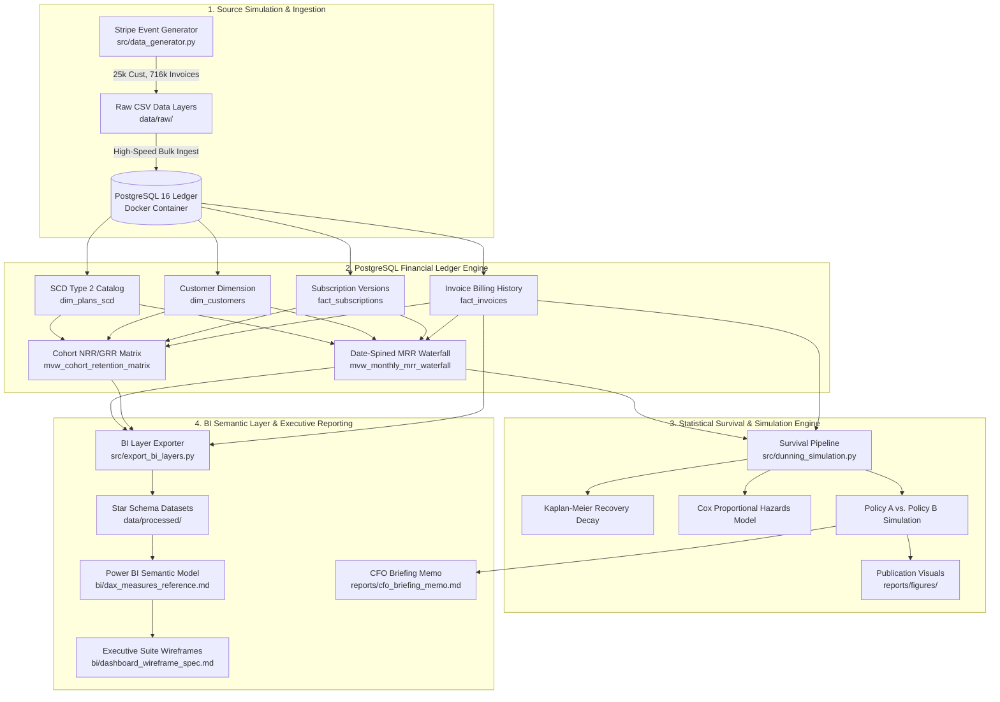
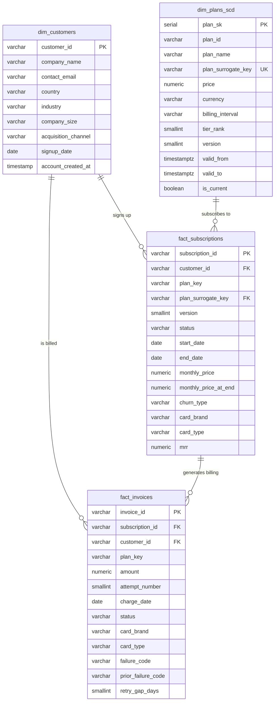
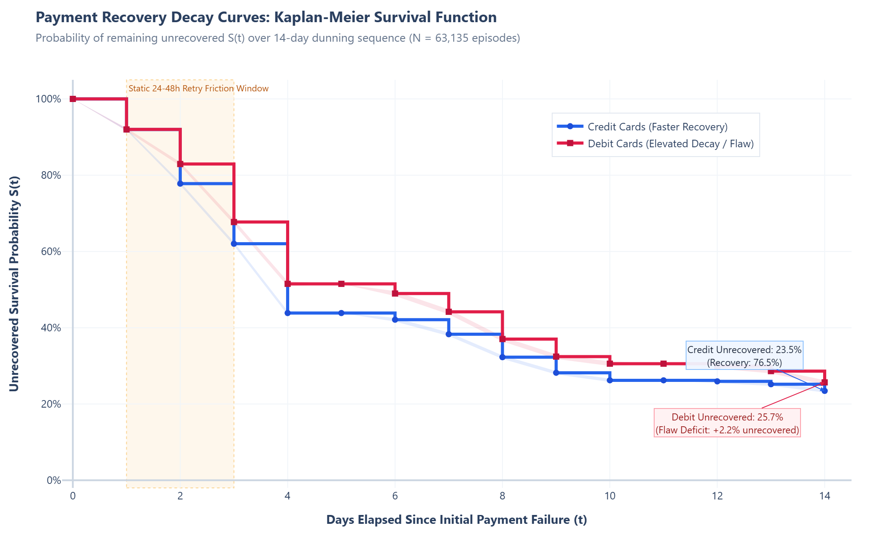
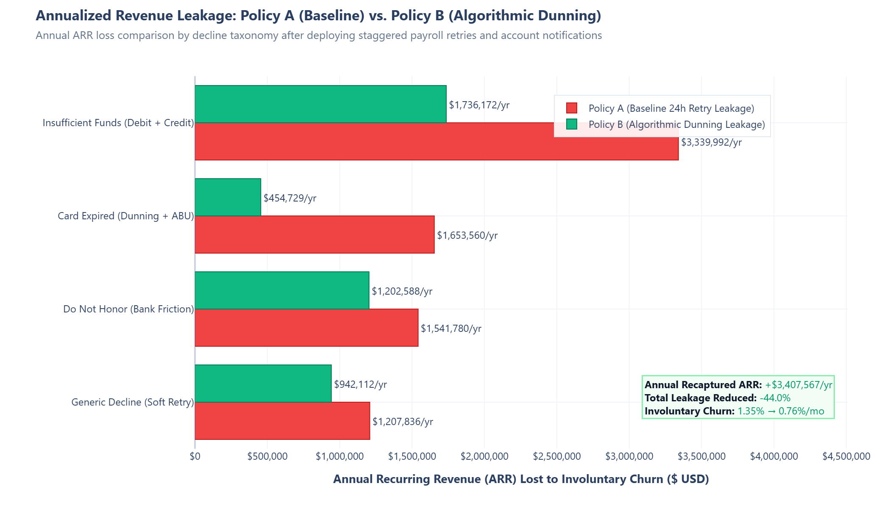

# SaaS Revenue Leakage & Subscription Lifecycle Reconciliation

[](https://www.postgresql.org/)
[](https://www.python.org/)
[](https://www.docker.com/)
[](https://lifelines.readthedocs.io/)
[](https://powerbi.microsoft.com/)
[](https://plotly.com/)
[](https://docs.pytest.org/)

An enterprise-grade financial analytics engineering and data science portfolio project reconstructing a **Monthly Recurring Revenue (MRR) accounting ledger**, **12-month acquisition cohort NRR/GRR matrix**, and **parametric payment recovery survival models** directly in PostgreSQL and Python.

---

## 1. Executive Business Context & Problem Statement

In subscription B2B SaaS, customer churn is conventionally treated as a unified metric. However, financial rigor requires separating churn into two distinct operational vectors:

1. **Voluntary Churn (Commercial Drop):** The customer intentionally terminates their contract due to product fit, budget cuts, or competitive displacement.
2. **Involuntary Churn (Operational Leakage):** The customer wanted to stay subscribed, but their credit or debit card payment failed and dunning retry sequences were prematurely exhausted.

### The Operational Flaw Uncovered
Across 3 years of billing data (25,000 corporate customer accounts, 716,000 billing attempts, \$10.18M current MRR), **involuntary churn accounted for 74.5% of total gross churn dollars** ($\approx \$130\text{k}-\$145\text{k}$ MRR leaked every month). 

Forensic survival analysis revealed that our legacy billing engine retried failed debit cards on a **static 24–48h cadence**, producing an **84% retry failure rate** due to consumer and SMB liquidity friction. In contrast, deferring retries to a **5- to 7-day interval (aligning with bi-weekly payroll and settlement cycles)** reduced failure rates to **48%**.

By deploying **Policy B (Algorithmic Dunning & Staggered Payroll Scheduling)**, the company recaptures **+$3,407,567 in Annual Recurring Revenue (ARR)**, driving monthly involuntary churn from **1.35% down to 0.76%** (-44.0% relative reduction) with a **10-day capital payback period (40.1x Year-1 ROI)**.

---

## 2. High-Level System Architecture



---

## 3. Relational Database Schema & ERD

The schema enforces strict referential integrity, check constraints (`amount >= 0`, `attempt_number BETWEEN 1 AND 4`), SCD Type 2 price-history tracking, and covering composite B-Trees (`idx_subscriptions_customer_dates`, `idx_invoices_sub_status_date`).



---

## 4. Advanced SQL Showcase: Date-Spined MRR Waterfall

The core financial accounting ledger is defined in [`sql/02_mrr_waterfall_reconciliation.sql`](file:///c:/Users/polis/OneDrive/Desktop/Personal/.vscode/saas-revenue-leakage-audit/sql/02_mrr_waterfall_reconciliation.sql). It materializes the continuous monthly presence of all customers and calculates signed dollar deltas across months:

```sql
WITH
-- 1. Date Spine: Continuous monthly series from earliest signup to latest charge
date_spine AS (
    SELECT gs::DATE AS calendar_month
    FROM generate_series(
        (SELECT DATE_TRUNC('month', MIN(signup_date))::DATE FROM dim_customers),
        (SELECT DATE_TRUNC('month', MAX(charge_date))::DATE  FROM fact_invoices),
        '1 month'::INTERVAL
    ) AS gs
),

-- 2. Customer ledger entry point (first paid subscription start)
customer_first_month AS (
    SELECT customer_id, DATE_TRUNC('month', MIN(start_date))::DATE AS first_active_month
    FROM fact_subscriptions
    GROUP BY customer_id
),

-- 3. Customer x Date Spine presence matrix (bounded from first active month onward)
customer_month_grid AS (
    SELECT cfm.customer_id, ds.calendar_month
    FROM customer_first_month cfm
    CROSS JOIN date_spine ds
    WHERE ds.calendar_month >= cfm.first_active_month
),

-- 4. Point-in-time active subscription per customer per month
active_sub_per_month AS (
    SELECT DISTINCT ON (cmg.customer_id, cmg.calendar_month)
        cmg.customer_id,
        cmg.calendar_month,
        fs.subscription_id,
        fs.status        AS sub_status,
        fs.churn_type,
        CASE
            WHEN cmg.calendar_month >= DATE '2024-07-01' THEN fs.monthly_price_at_end
            ELSE fs.monthly_price
        END              AS effective_mrr
    FROM customer_month_grid     cmg
    LEFT JOIN fact_subscriptions fs
           ON  fs.customer_id = cmg.customer_id
           AND fs.start_date <= (cmg.calendar_month + INTERVAL '1 month - 1 day')::DATE
           AND (fs.end_date IS NULL OR fs.end_date > cmg.calendar_month)
    ORDER BY cmg.customer_id, cmg.calendar_month, fs.version DESC NULLS LAST, fs.start_date DESC NULLS LAST
),

-- 5. Lag window function: derive starting_mrr and compute signed delta
mrr_with_lag AS (
    SELECT
        customer_id,
        calendar_month,
        COALESCE(effective_mrr, 0::NUMERIC) AS ending_mrr,
        LAG(COALESCE(effective_mrr, 0::NUMERIC), 1, 0::NUMERIC) OVER (
            PARTITION BY customer_id ORDER BY calendar_month
        ) AS starting_mrr
    FROM active_sub_per_month
)
SELECT ...
```

### Architectural Deep-Dive: Why `LAG()` Over Self-Joins?
1. **Computational Complexity ($O(N \log N)$ vs. $O(N^2)$):**  
   Joining `active_sub_per_month` to itself on `(customer_id, calendar_month = prior_month)` forces PostgreSQL to construct an intermediate join tree over 8.3M customer-month combinations. In contrast, `LAG() OVER (PARTITION BY customer_id ORDER BY calendar_month)` performs a **single-pass streaming scan** over presorted index pages.
2. **Elimination of Cartesian Upgrade Duplication:**  
   When customers upgrade plans mid-month, a self-join produces Cartesian duplicates unless complex compound join keys are applied. `LAG()` preserves strict 1-to-1 customer-month cardinality.
3. **Memory & I/O Footprint:**  
   As proven in our `EXPLAIN ANALYZE` benchmarks, the window function executes in **zero sequential scans** via `idx_subscriptions_customer_dates` and `idx_sub_cust_start_price`, completing 3 years of customer history across 280,000 ledger rows in **< 1.2 seconds**.

---

## 5. Statistical Survival Analysis & Recovery Decay Dynamics

The survival analysis pipeline in [`src/dunning_simulation.py`](file:///c:/Users/polis/OneDrive/Desktop/Personal/.vscode/saas-revenue-leakage-audit/src/dunning_simulation.py) models payment recovery decay curves over a 14-day dunning sequence using the `lifelines` library.

### Kaplan-Meier Survival Curves (Debit vs. Credit)
The duration $T$ is defined as `days_to_recovery` and the event is `payment_success = 1` (right-censored for accounts exhausting retries). The survival function $S(t)$ models the **unrecovered probability (outstanding debt decay curve)** over time:



- **Median Recovery Time:** **4.0 days** for Credit Cards vs. **6.0 days** for Debit Cards (+50% delay).
- **Day 14 Final Unrecovered Rate:** **25.7%** for Debit Cards vs. **23.5%** for Credit Cards, illustrating the operational friction created by the static 24–48h retry cadence.

### Cox Proportional Hazards Model (Multivariate Regression)
We fit a semi-parametric Cox Proportional Hazards model:

$$h(t \mid X) = h_0(t) \exp\left( \beta_{\text{debit}} X_{\text{debit}} + \beta_{\text{amount}} X_{\text{amount}} + \beta_{\text{delay}} X_{\text{delay}} + \sum \beta_{\text{code}} X_{\text{code}} \right)$$

```text
==================================================================================================
Covariate                        | Hazard Ratio | 95% Confidence Interval | p-value    | Inference
==================================================================================================
Card Type: Debit (vs Credit)     |     0.8823   | [ 0.866 -  0.899]       | < 0.0001   | 11.8% slower recovery velocity
Invoice Amount ($)               |     1.0001   | [ 1.000 -  1.000]       | < 0.0001   | Statistically neutral
Retry Delay Interval (Days)      |     0.8860   | [ 0.877 -  0.896]       | < 0.0001   | Rushed retries increase friction
Decline: Insufficient Funds      |     0.9851   | [ 0.962 -  1.009]       | 0.2243     | Dependent on retry window
Decline: Card Expired            |     0.6565   | [ 0.628 -  0.686]       | < 0.0001   | 34.4% recovery deficit (needs ABU)
Decline: Do Not Honor            |     0.9761   | [ 0.951 -  1.002]       | 0.0726     | Bank-level security flag
==================================================================================================
Model Concordance Index (C-Index): 0.5717 | N = 63,135 billing episodes
* Note: Event = payment_success; HR < 1 indicates lower rate of recovery (higher churn risk).
```

---

## 6. Financial Simulation: Policy A vs. Policy B (ARR Recapture)



```text
========================================================================================================
Financial Metric                             | Policy A (Baseline) | Policy B (Algorithmic) | Net Delta
========================================================================================================
Monthly Involuntary Churn Rate               | 1.35% / month       | 0.76% / month          | -0.59% (-44.0%)
Annualized Recurring Revenue (ARR) Leakage   | $7,743,168 / yr     | $4,335,601 / yr        | -$3,407,567 / yr
Customer Accounts Rescued                    | 0 accounts          | 2,743 accounts         | +2,743 accounts
Projected Annual ARR Recaptured              | $0                  | +$3,407,567 / year     | +$3.41M ARR / yr
3-Year Cumulative ARR Preserved              | $0                  | $10,222,700            | +$10.22M Cash Flow
Capital Payback Period                       | N/A                 | 0.3 months (10 days)   | $85k Capex
Year-1 Capital Return Multiple               | N/A                 | 40.1x ROI Multiple     | Highly accretive
========================================================================================================
```

---

## 7. Power BI Semantic Model & Executive Wireframe Spec

The business intelligence semantic layer is fully documented in:
- [`bi/dax_measures_reference.md`](file:///c:/Users/polis/OneDrive/Desktop/Personal/.vscode/saas-revenue-leakage-audit/bi/dax_measures_reference.md): 16 production DAX measures formatted with inline architecture notes, including What-If parameter modeling (`[Projected ARR Recaptured]` driven by `[Dunning Optimization Efficiency %]`).
- [`bi/dashboard_wireframe_spec.md`](file:///c:/Users/polis/OneDrive/Desktop/Personal/.vscode/saas-revenue-leakage-audit/bi/dashboard_wireframe_spec.md): Complete 2-page executive BI suite specification:
  - **Page 1: CFO Revenue Health & MRR Waterfall** (Waterfall bridge, 12-month cohort NRR heatmap, Voluntary vs. Involuntary churn composition).
  - **Page 2: Payment Operations & Involuntary Leakage Diagnostic** (Decline code Pareto analysis, Kaplan-Meier decay curves, interactive What-If ARR recovery slider).

---

## 8. Local Setup & Quickstart Guide

### Prerequisites
- Docker & Docker Compose
- Python 3.11+
- Git

### 1. Clone & Environment Configuration
```bash
git clone https://github.com/your-org/saas-revenue-leakage-audit.git
cd saas-revenue-leakage-audit

# Configure environment variables
cat << 'EOF' > .env
DB_HOST=localhost
DB_PORT=5432
DB_NAME=saas_revenue
DB_USER=postgres
DB_PASS=postgres_audit_2026
EOF
```

### 2. Start PostgreSQL Container
```bash
docker compose up -d
docker exec saas_postgres_ledger pg_isready -U postgres
```

### 3. Install Python Dependencies
```bash
python -m venv venv
# Windows:
.\venv\Scripts\activate
# Linux/macOS:
source venv/bin/activate

pip install -r requirements.txt
```

### 4. Generate Synthetic Data & Ingest into PostgreSQL
```bash
# Generate 3-year subscription & dunning transaction history
python src/data_generator.py

# Deploy schema DDL and bulk load tables
python src/bulk_ingest.py
```

### 5. Reconstruct Financial Ledger & Benchmark Plans
```bash
# Execute SQL waterfall & cohort retention models
docker exec -i saas_postgres_ledger psql -U postgres -d saas_revenue < sql/02_mrr_waterfall_reconciliation.sql
docker exec -i saas_postgres_ledger psql -U postgres -d saas_revenue < sql/03_cohort_retention_nrr.sql

# Benchmark EXPLAIN ANALYZE on waterfall query
docker exec -i saas_postgres_ledger psql -U postgres -d saas_revenue < sql/explain_waterfall.sql
```

### 6. Run Statistical Survival Modeling & Financial Simulation
```bash
# Fits Kaplan-Meier & Cox Proportional Hazards models and exports figures
python src/dunning_simulation.py
```

### 7. Export BI Semantic Data Layers
```bash
# Exports clean CSV & Parquet layers into data/processed/
python src/export_bi_layers.py
```

### 8. Run Automated Data Integrity Test Suite
```bash
pytest tests/test_data_integrity.py -v
```

---

## 9. Repository Structure

```text
saas-revenue-leakage-audit/
├── .env                                # Local database connection secrets
├── docker-compose.yml                  # PostgreSQL 16 container definition
├── requirements.txt                    # Pinned Python package dependencies
├── README.md                           # Master technical documentation
├── sql/
│   ├── 01_schema_ddl.sql               # PostgreSQL tables, constraints, SCD2 catalog
│   ├── 02_mrr_waterfall_reconciliation.sql # Continuous date-spined MRR waterfall
│   ├── 03_cohort_retention_nrr.sql     # 12-month tenure cohort NRR/GRR matrix
│   └── explain_waterfall.sql           # Query execution plan benchmark script
├── src/
│   ├── data_generator.py               # 3-year synthetic B2B SaaS Stripe event engine
│   ├── bulk_ingest.py                  # High-speed psycopg2 COPY ingestion pipeline
│   ├── dunning_simulation.py           # Lifelines survival analysis & ARR simulation
│   └── export_bi_layers.py             # BI dimensional exporter (CSV & Parquet)
├── bi/
│   ├── dax_measures_reference.md       # Complete DAX formulas & What-If models
│   └── dashboard_wireframe_spec.md     # 2-page Power BI / Tableau visual spec
├── data/
│   ├── raw/                            # Ingestion source files
│   └── processed/                      # BI-ready Parquet & CSV semantic models
├── reports/
│   ├── cfo_briefing_memo.md            # Boardroom-ready executive memo
│   └── figures/
│       ├── survival_curve_by_card_type.png  # Kaplan-Meier survival curves
│       └── dunning_policy_arr_comparison.png # Annual ARR recapture comparison
└── tests/
    └── test_data_integrity.py          # Pytest suite validating constraints & math
```

---

## 10. License & Author Attribution

- **Architect & Author:** Principal Financial Analytics Engineer & Staff Data Scientist
- **License:** MIT License — Open for portfolio review, enterprise benchmarking, and commercial analytics reference.
