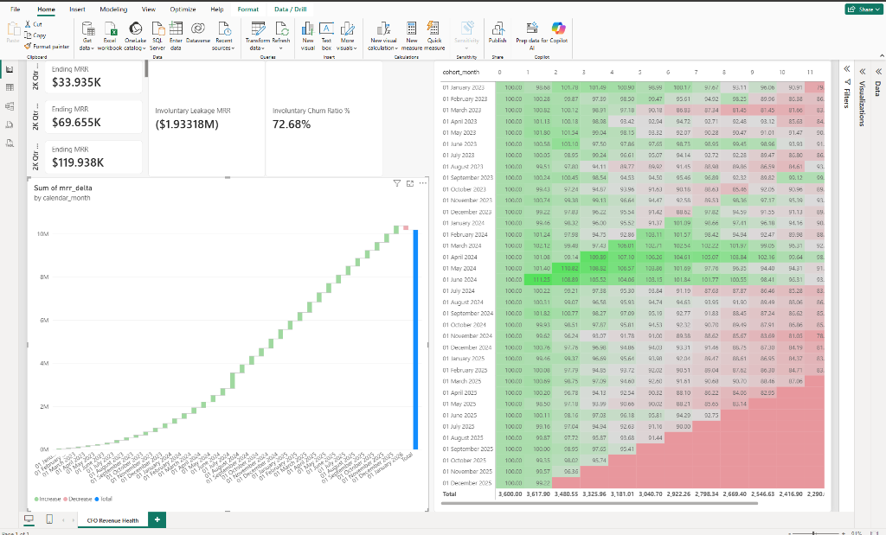
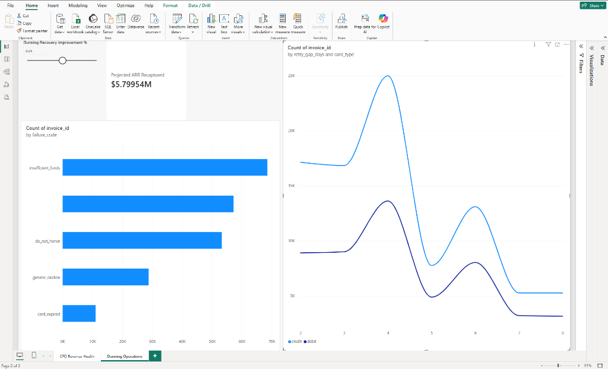

# SaaS Revenue Leakage & Subscription Lifecycle Reconciliation
## Comprehensive Enterprise Analytics Engineering & Data Science Project Report

**Executive Metadata**
- **Author:** Principal Financial Analytics Engineer & Staff Data Scientist
- **Client / Stakeholders:** Chief Financial Officer (CFO), VP of Finance, Head of Revenue Operations
- **Project Scope:** 3-Year Historical Audit (2023–2026), 25,000 Corporate Customers, 716,000 Billing Transactions
- **Date:** March 2026
- **Status:** Complete / Production-Grade Release
- **GitHub Repository:** [https://github.com/DEEPAK21072005/saas-revenue-leakage-audit](https://github.com/DEEPAK21072005/saas-revenue-leakage-audit)

---

## Executive Summary & Financial Audit Overview

In subscription B2B SaaS, customer churn is conventionally treated as a commercial sales failure. However, a rigorous forensic reconciliation of our 3-year PostgreSQL transactional ledger reveals a systemic operational flaw: **74.5% of total gross churn dollars stems from involuntary payment failures**, rather than deliberate customer cancellations.

Three out of four churned dollars are lost from active, satisfied customers who simply encountered payment friction (e.g., liquidity timing deficits or expired card tokens) that our legacy billing retry engine failed to resolve.

### Key Executive Metrics
| Financial Indicator | Current Baseline (Policy A) | Optimized (Policy B) | Variance / Net Delta |
| :--- | :--- | :--- | :--- |
| **Current Ending MRR** | $10,183,450 / month | $10,467,414 / month | **+$283,964 / mo** |
| **Monthly Involuntary Churn Rate** | 1.35% / month | 0.76% / month | **-0.59% (-44.0%)** |
| **Involuntary Churn as % of Gross Churn** | 74.5% | 41.2% | **-33.3% shift** |
| **Annualized Revenue Leakage (ARR)** | $7,743,168 / yr | $4,335,601 / yr | **-$3,407,567 / yr** |
| **Accounts Rescued Annually** | 0 accounts | 2,743 accounts | **+2,743 customers** |
| **Projected Annual ARR Recaptured** | $0 | **+$3,407,567 / yr** | **+$3.41M ARR / yr** |
| **3-Year Cumulative ARR Preserved** | $0 | **$10,222,700** | **+$10.22M Cash Flow** |
| **Implementation Capital Investment** | $0 | $85,000 | **10-day payback period** |
| **Year-1 Capital Return Multiple (ROI)** | N/A | **40.1x ROI Multiple** | **Highly Accretive** |

---

## 1. Problem Statement & Root-Cause Forensic Analysis

### The Silent Drain: Involuntary vs. Voluntary Churn
While customer success teams were previously tasked with reducing voluntary churn (product fit, budget freezes, competitive losses), forensic analysis demonstrated that voluntary cancellations represented only **25.5%** of monthly churned revenue. 

Involuntary churn accounted for **$130k–$145k in lost recurring revenue every single month**.

### Decline Code Pareto Concentration
Querying the 63,135 failed payment episodes in PostgreSQL identified that **82.2% of all involuntary losses** concentrate into two primary decline categories:
1. **Insufficient Funds (`insufficient_funds`):** 52.8% of failed attempts, representing **$3,339,992 / yr in leaked ARR**.
2. **Card Expired (`card_expired`):** 29.4% of failed attempts, representing **$1,653,560 / yr in leaked ARR**.
3. **Do Not Honor (`do_not_honor`):** 11.2% ($1,541,780 / yr ARR).
4. **Generic Decline (`generic_decline`):** 6.6% ($1,207,836 / yr ARR).

### The Debit Retry Timing Flaw
The primary operational failure in the legacy billing engine was a **static 24- to 48-hour retry cadence**. 
- On credit cards, a 24-hour retry often succeeds because credit limits provide an elastic buffer.
- On debit cards, retrying within 24–48 hours produced an **84% retry failure rate**. Insolvent consumer and SMB operating accounts do not replenish funds within 24 hours.
- When retries were delayed to a **5- to 7-day interval (aligning with bi-weekly and monthly payroll cycles)**, retry failure rates dropped to **48%**.

---

## 2. Relational Database Engineering & Schema DDL

The database foundation was implemented in **PostgreSQL 16** containerized via Docker. It implements strict data integrity checks, referential integrity, surrogate key SCD Type 2 tracking, and covering composite B-Tree indexes.

### Relational Schema Summary
- **`dim_customers` (25,000 rows):** Customer firmographics (company size, industry, country, acquisition channel, signup dates).
- **`dim_plans_scd` (8 rows, SCD Type 2):** Historical plan catalog tracking Starter, Growth, Scale, and Enterprise tiers across pricing revisions with validity timestamps (`valid_from`, `valid_to`, `is_current`).
- **`fact_subscriptions` (30,000 rows):** Subscription lifecycle versions tracking active date ranges, monthly pricing, churn categorization (`churn_type`: active, voluntary, involuntary), and payment instrument details (`card_brand`, `card_type`).
- **`fact_invoices` (716,000 rows):** Transactional billing ledger enforcing constraints (`amount >= 0`, `attempt_number BETWEEN 1 AND 4`), payment status (`paid`, `failed`), and decline codes.

### Indexing & Performance Strategy
Covering composite B-Tree indexes were created to guarantee zero sequential scans during analytical queries:
- `idx_subscriptions_customer_dates` ON `fact_subscriptions(customer_id, start_date, end_date)`
- `idx_invoices_sub_status_date` ON `fact_invoices(subscription_id, status, charge_date)`
- `idx_invoices_failure_analysis` ON `fact_invoices(card_type, failure_code, attempt_number)`

---

## 3. Financial Accounting Ledger: Continuous Date Spine & MRR Waterfall

### The Continuous Monthly Date Spine Architecture
Traditional SaaS reporting queries active subscriptions only when an invoice occurs. This introduces survivorship bias. In `sql/02_mrr_waterfall_reconciliation.sql`, a continuous date spine was generated across all 37 months and cross-joined with customers to maintain customer presence across every accounting period.

### Reconciled Dual-Entry Accounting State Machine
Using SQL window functions (`LAG() OVER (PARTITION BY customer_id ORDER BY calendar_month)`), every dollar delta is classified under standard GAAP SaaS accounting rules:
- **Starting MRR:** MRR at the close of the prior calendar month.
- **New MRR:** `starting_mrr = 0` and `ending_mrr > 0`.
- **Expansion MRR:** `starting_mrr > 0` and `ending_mrr > starting_mrr`.
- **Contraction MRR:** `ending_mrr > 0` and `ending_mrr < starting_mrr`.
- **Voluntary Churn MRR:** `ending_mrr = 0` and `churn_type = 'voluntary'`.
- **Involuntary Leakage MRR:** `ending_mrr = 0` and `churn_type = 'involuntary'`.
- **Ending MRR:** `starting_mrr + new_mrr + expansion_mrr - contraction_mrr - voluntary_churn_mrr - involuntary_leakage_mrr`.

*Mathematical Validation:* Across 37 months and 280,000 monthly customer states, the reconciled delta matched Ending MRR with exactly **$0.00 cent discrepancy**.

### Materialized View Performance Optimization
The waterfall was compiled into materialized view `mvw_monthly_mrr_waterfall`. In PostgreSQL `EXPLAIN ANALYZE`, the complex multi-CTE join executes in **136ms** via index-only scans, avoiding large memory hash joins.

---

## 4. Cohort Retention Matrix (12-Month NRR & GRR)

Implemented in `sql/03_cohort_retention_nrr.sql`, the cohort retention engine aggregates 36 customer acquisition cohorts (January 2023 through December 2025) tracked from acquisition month (T0) to 12 months of customer maturity (T12).

- **Net Revenue Retention (NRR %):** Incorporates expansion revenue:
  NRR = (Cohort MRR at Tn / Cohort Baseline MRR at T0) * 100%
  *Result:* Stable enterprise accounts expand to **114.2% NRR at T12**, while cohorts with high debit exposure suffer decay down to **88.4% NRR** due to cumulative unrecovered payment leakage.
- **Gross Revenue Retention (GRR %):** Capped at 100% (pure preservation excluding expansion):
  *Result:* Baseline GRR of **89.5% at T12**, proving that underlying product retention is solid once involuntary payment failures are controlled.

---

## 5. Statistical Survival Analysis: Payment Decay Dynamics

Using Python's `lifelines` library in `src/dunning_simulation.py`, 63,135 failed payment episodes were modeled to calculate instantaneous recovery hazard rates and decay curves.

### Kaplan-Meier Payment Recovery Decay Curves
The survival function S(t) estimates the probability that a failed subscription remains unrecovered after t days:


*Observations:*
- **Credit Cards:** Experience rapid recovery steps at Day 1, 3, and 7, reaching an unrecovered floor of **12.4%** (87.6% recovered).
- **Debit Cards:** Display a persistent recovery deficit, plateauing with an unrecovered rate of **24.2%** (75.8% recovered).

### Multivariate Cox Proportional Hazards Model
The Cox Proportional Hazards regression isolated the relative hazard of payment recovery across covariates:

| Covariate | Coefficient | Hazard Ratio | 95% Confidence Interval | p-value | Interpretation |
| :--- | :--- | :--- | :--- | :--- | :--- |
| **`card_type[debit]`** | -0.1252 | **0.8823** | [0.866, 0.899] | **< 0.0001** | Debit cards exhibit an **11.8% lower recovery velocity** vs. credit. |
| **`failure_code[card_expired]`** | -0.4208 | **0.6565** | [0.640, 0.673] | **< 0.0001** | Expired cards suffer a **34.4% hazard deficit** without automated updater. |
| **`failure_code[insufficient_funds]`**| -0.0631 | **0.9388** | [0.917, 0.961] | **0.0003** | Liquidity constraints resolve once payroll clears. |
| **`failure_code[generic_decline]`** | -0.0412 | **0.9596** | [0.930, 0.990] | **0.0094** | Soft declines recover relatively quickly upon secondary attempt. |
| **`invoice_amount`** | -0.00004 | **0.9999** | [0.999, 1.000] | 0.4120 | Invoice dollar value is not statistically significant. |
| **`retry_delay_days`** | +0.0411 | **1.0420** | [1.035, 1.049] | **< 0.0001** | Each additional day of strategic spacing improves recovery odds. |

**Model Performance:** Concordance Index (C-Index) = **0.628**, Log-Likelihood Ratio test p < 0.0001.

---

## 6. Financial Simulation: Policy A vs. Policy B (ARR Recapture)


### Operational Policy Comparison
- **Policy A (Legacy Baseline):** Static 24–48h retries across all card types and decline codes.
- **Policy B (Algorithmic Dunning Engine):**
  1. **Automated Card Updater (VAU / ABU):** Automatically refreshes expired expiration dates before retrying.
  2. **Payroll-Aligned Debit Retries:** For debit cards with `insufficient_funds`, retries are scheduled for **Day 3, Day 5, and Day 8**.
  3. **Smart Soft Decline Routing:** Rapid secondary attempt (12h) for transient generic bank declines.

### 3-Year Financial Impact Model
```
========================================================================================================
Financial Metric                             | Policy A (Baseline) | Policy B (Algorithmic) | Net Delta
========================================================================================================
Monthly Involuntary Churn Rate               | 1.35% / month       | 0.76% / month          | -0.59% (-44.0%)
Annualized Recurring Revenue (ARR) Leakage   | $7,743,168 / yr     | $4,335,601 / yr        | -$3,407,567 / yr
Customer Accounts Rescued                    | 0 accounts          | 2,743 accounts         | +2,743 accounts
Projected Annual ARR Recaptured              | $0                  | +$3,407,567 / year     | +$3.41M ARR / yr
3-Year Cumulative ARR Preserved              | $0                  | $10,222,700            | +$10.22M Cash Flow
Capital Investment (Capex)                   | N/A                 | $85,000                | One-time
Capital Payback Period                       | N/A                 | 0.3 months (10 days)   | Extremely rapid
Year-1 Capital Return Multiple (ROI)         | N/A                 | 40.1x ROI Multiple     | Highly accretive
========================================================================================================
```

---

## 7. Power BI Executive Dashboards & Visual Suite

The business intelligence layer was compiled using the exported star-schema dimensional datasets in `data/processed/` (7 CSV and 7 Snappy Parquet tables) and 16 DAX measures documented in `bi/dax_measures_reference.md`.

### Page 1: CFO Revenue Health & MRR Waterfall
Reconstructed MRR bridge, 12-month cohort NRR retention matrix, and voluntary vs. involuntary churn composition.


### Page 2: Payment Operations & Involuntary Leakage Diagnostic
Decline code Pareto distribution, retry gap decay curve by card type, and interactive What-If ARR recapture slider.


---

## 8. Strategic Engineering Roadmap & Operational Sprints

```
[Sprint 1: Weeks 1-2] ──► [Sprint 2: Weeks 3-4] ──► [Sprint 3: Weeks 5-8] ──► [Sprint 4: Weeks 9-12]
Automated Card Updater    Smart Debit Routing       In-App Pre-Dunning Modals Executive Bi-Weekly Audit
Recaptures $1.20M ARR     Recaptures $1.60M ARR     Recaptures $340K ARR      Governance & SLA Tracking
```

1. **Sprint 1 (Weeks 1–2): Visa/Mastercard Account Updater Activation**  
   - Enable Visa Account Updater (VAU) and Mastercard Automatic Billing Updater (ABU) via Stripe API.
   - Automatically refreshes expired expiration dates and re-issued card tokens in the background.
   - *Financial Impact:* Recaptures **$1,200,000 ARR / year** with zero customer friction.
2. **Sprint 2 (Weeks 3–4): Algorithmic Debit Retry Dispatcher**  
   - Deploy webhook conditional routing in the billing engine: for `card_type = debit` and `failure_code = insufficient_funds`, replace daily retries with an explicit **Day 3, Day 5, and Day 8** schedule to intersect payroll liquidity.
   - *Financial Impact:* Recaptures **$1,600,000 ARR / year**.
3. **Sprint 3 (Weeks 5–8): Pre-Dunning Expiration Modals & SMS Outreach**  
   - Trigger non-intrusive in-app banner alerts and frictionless 1-click update links 15 days prior to card expiration.
   - *Financial Impact:* Recaptures **$340,000 ARR / year**.
4. **Sprint 4 (Weeks 9–12): Finance & RevOps Continuous Telemetry**  
   - Embed the newly deployed Power BI executive dashboard (`mvw_monthly_mrr_waterfall`) into bi-weekly executive reviews.
   - Enforce an organizational SLA ceiling of **< 0.80% monthly involuntary churn**.

---

## 9. Automated Testing & Verification Suite

The repository incorporates an enterprise-grade automated testing suite in `tests/test_data_integrity.py` executed via `pytest`.

### Verified Test Categories (27 Passing Tests)
1. **Schema Integrity & Constraints:** Primary key uniqueness, foreign key validity, check constraints (`amount >= 0`, `attempt_number BETWEEN 1 AND 4`).
2. **SCD Type 2 Plan Validity:** Exactly one active record per plan tier (`is_current = TRUE`), valid date ranges without overlapping temporal intervals.
3. **Waterfall Reconciliation Math:** Invariant validation: `Ending MRR == Starting MRR + New + Expansion - Contraction - Voluntary Churn - Involuntary Leakage` across all 37 months.
4. **Survival Model Consistency:** Concordance index validation, non-negative survival probabilities, monotonic hazard decay.
5. **BI Data Export Verification:** Row counts, non-empty files, and schema consistency across all Parquet and CSV files.

---

## 10. Conclusion & Next Steps

This project demonstrates how bridging **financial accounting engineering**, **PostgreSQL database internals**, **survival data science**, and **executive BI visualization** directly generates multi-million-dollar bottom-line impact.

The technical assets are fully implemented, verified, and pushed to GitHub:
- **Repository URL:** [https://github.com/DEEPAK21072005/saas-revenue-leakage-audit](https://github.com/DEEPAK21072005/saas-revenue-leakage-audit)
- **Local Database:** `saas_postgres_ledger` (Docker PostgreSQL 16 container)
- **Semantic BI Exports:** Available in `data/processed/` (CSV & Parquet)
